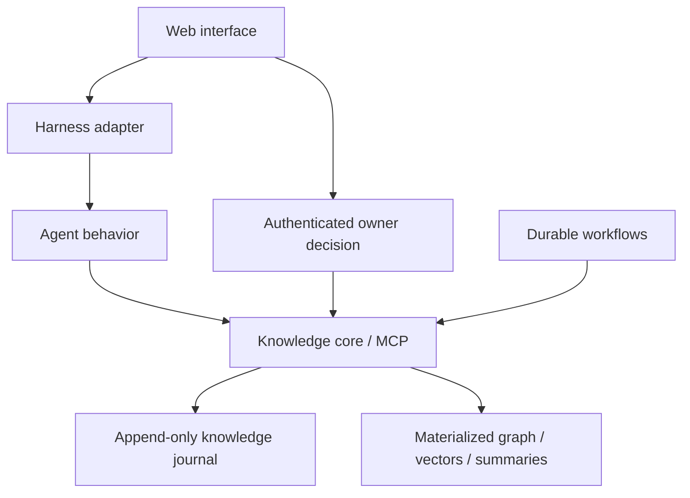

# Architecture

Status: component boundaries derived from v0.5; no services are implemented yet.

The authenticated owner path is distinct from agent tools. The harness may relay an owner decision but may not mint that decision or hold approval credentials.

| Component | Owns | Boundary |
|---|---|---|
| `services/core` | Domain model, proposals, approvals, journal, versions, materialization, provenance | Independent Python service; sole authority for trusted knowledge |
| `services/workflows` | Ingestion, extraction orchestration, fidelity checks, consolidation, scheduling | Uses core contracts; does not bypass approval or write trusted tables directly |
| `packages/agents` | Answering, evaluation, extraction, reporting behavior | Python modules independent of the chosen harness |
| `apps/harness` | Runtime integration, model adapters, conversation trajectories | TypeScript adapter; trajectories do not replace the knowledge journal |
| `apps/web` | Chat, sources, domain map, owner review, brief | TypeScript interface; owner actions are authenticated and validated by the core |
| `packages/contracts` | Protocol schemas, errors, examples, versioning | Shared wire boundary between Python and TypeScript |

## Knowledge flow

Source → candidate proposal → fidelity and risk checks → owner approval → appended change → materialized state → sourced answer and episode → feedback or gap → new proposal.

An accepted change becomes visible only when its retrieval indexes are ready. Responses identify the version actually served. Consolidation must preserve the approval boundary and provide a consistent state to readers.

## Technology baseline from the dossier

Python for the core and workflows; TypeScript for harness and interface. The proposed storage baseline is PostgreSQL with AGE and pgvector; the dossier also specifies Temporal, MCP, and AG-UI. The named harness is DeepSeek Harness / Cordis with a thin isolation adapter.

These are imported design selections, not verified dependencies. Confirm exact upstream identity, compatibility, licenses, and pinned versions before adding package manifests or infrastructure. See [open decisions](open-decisions.md) and source architecture (source import pending).
